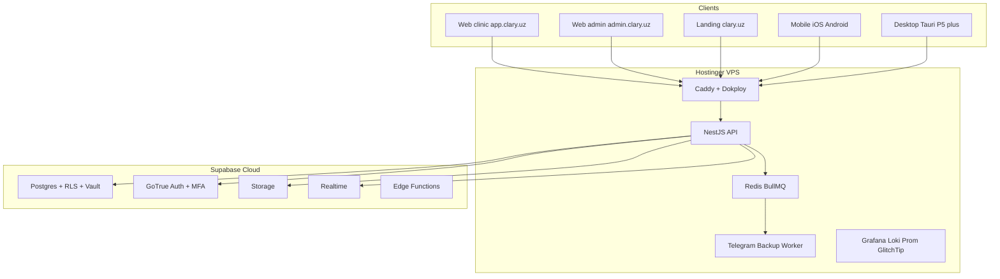

# Clary v2 Architecture Overview

## High-level diagram

## Five-layer tenant isolation

1. **Postgres RLS** — every table has `clinic_id UUID NOT NULL` + policy `clinic_id = get_my_clinic_id()`
2. **JWT claims** — `clinic_id` + `role` injected by a Supabase auth trigger (not user-editable)
3. **NestJS TenantGuard** — re-verifies `clinic_id` from JWT and attaches to `RequestContext` (AsyncLocalStorage)
4. **Scoped Supabase client** — the backend forwards the user's JWT to PostgREST so RLS fires at the DB level
5. **Audit** — every mutation logs actor, IP, before/after to `activity_journal` + `settings_audit_log` (tamper-evident hash chain)

## Key flows

See individual runbooks for each flow:

- [Signup & onboarding](../runbooks/signup-onboarding.md)
- [Subscription billing](../runbooks/billing.md)
- [Backup & restore](../runbooks/backup-restore.md)
- [Incident response](../runbooks/incident.md)
- [Impersonation safety](../runbooks/impersonation.md)
